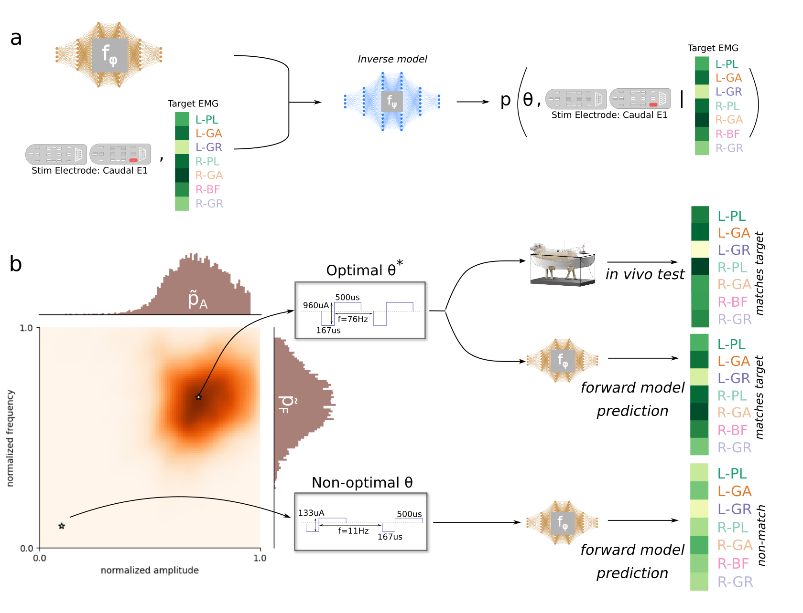

<p align="center">
<b> Fast Inference of Spinal Neuromodulation for Motor Control using Amortized Neural Networks </b>

</p>
<p align="justify">
Epidural electrical stimulation (EES) has recently emerged as a potential therapeutic approach to restore motor function following chronic spinal cord injury (SCI). However, the lack of robust and systematic algorithms to automatically identify EES parameters that drive sensorimotor networks has become one of the main barriers to the clinical translation of EES. In this work, we present a novel, fully-automated computational framework to identify EES parameter combinations that optimally select for target muscle activation.
</p>

### Creating a runtime environment
### Datasets

### Forward model training
```
OMP_NUM_THREADS=1 python main.py hydra/launcher=joblib  \
                                 hydra.run.dir=<path to dir you want as a working directory> \
                                 model=mlp \
                                 mode=train \
                                 datamodule=sheep_20210610 \
                                 model_save_path=<path to save/load checkpoints> \
                                 model.network.out_size=7 \
                                 model.network.in_size=20 \
                                 trainer.device='cpu'

```
<p align="justify">
We note that model.network.out_size and model.network.in_size should be specified based on the number of EMG channels used and the EES parameter dimensionality respectively.
</p>


### Forward model evaluation
To evaluate the forward model, one can use the same command as above but with the flag `mode=eval`. To extract error metrics (such as per-EMG channel L1 prediction errors) set `mode=metrics`. You can also perform a simple Maximum Likelikhood Estimation using a genetic algorithm to recover EES parameters by setting `mode=MLE`.

### Training the electrode-conditioned inverse model
```
OMP_NUM_THREADS=1 python main.py  hydra/launcher=joblib  \
                                  hydra.run.dir=<path to dir you want as a working directory> \    
                                  model=mlp \
                                  mode=inference  \
                                  datamodule=sheep_20210610 \
                                  model_save_path=<path to save/load checkpoints> \
                                  electrode_index=<the electrode that you want to condition on. range [0, num_electrodes-1]>  \
                                  target_index=<pick a target EMG. Chosen from the test set>  \
                                  model.network.out_size=7 \
                                  model.network.in_size=20 \
                                  trainer.device='cpu'
```
### Parallelize the training of electrode-conditioned inverse models
As mentioned in the manuscript, all the electrode-conditioned inverse models can be trained in parallel. We'll use the hydra joblib launcher for this purpose.
```
OMP_NUM_THREADS=1 python main.py  hydra/launcher=joblib  \
                                  hydra.run.dir=<path to dir you want as a working directory> \    
                                  model=mlp \
                                  mode=inference  \
                                  datamodule=sheep_20210610 \
                                  model_save_path=<path to save/load checkpoints> \
                                  electrode_index=0,1,2,3,...  \
                                  target_index=<pick a target EMG. Chosen from the test set. This can be parallelized too>  \
                                  model.network.out_size=7 \
                                  model.network.in_size=20 \
                                  trainer.device='cpu' \
                                  --multirun
```
